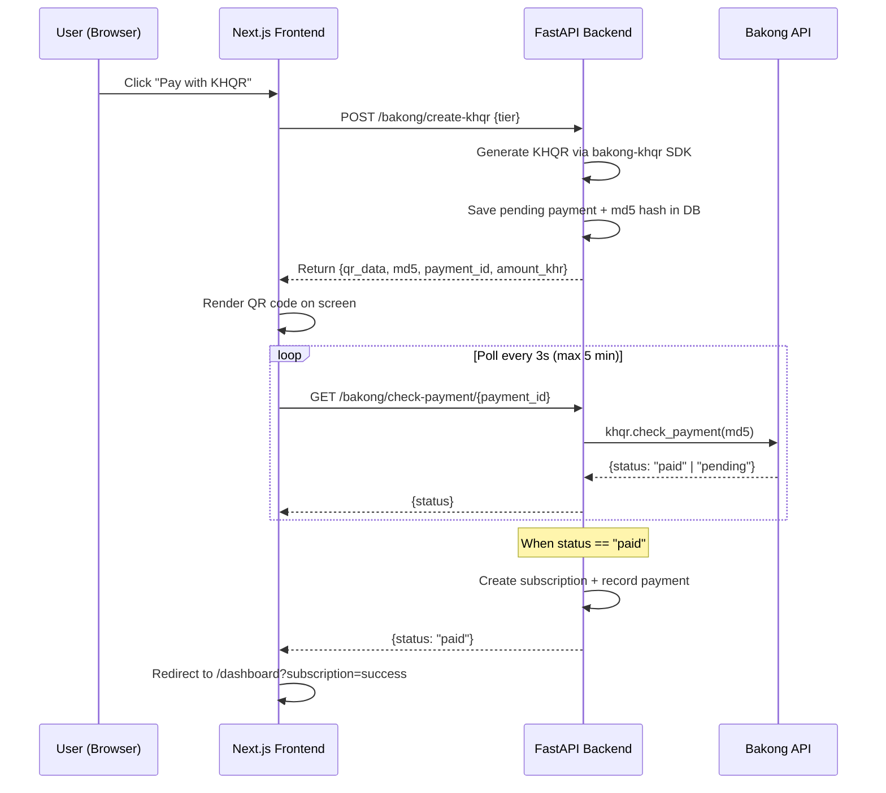

# Bakong KHQR Payment Integration

Integrate Bakong KHQR as a second payment method alongside Stripe, enabling Cambodian users to pay for subscriptions via QR code scanning with any Bakong-supported banking app.

## Architecture Overview

The Bakong KHQR flow is fundamentally different from Stripe. Stripe redirects the user to a hosted checkout page. KHQR generates a QR code that the user scans with their banking app, then we **poll** the Bakong API to detect when the payment has been confirmed.



## Proposed Changes

### Backend — FastAPI Server (`saas-mvp-starter-server`)

---

#### [MODIFY] [config.py](file:///Users/macbook/Documents/CADT-Year%204/Term%201/Internship2/Dataticon/SaaS/saas-mvp-starter-server/app/core/config.py)

Add Bakong configuration fields:
- `BAKONG_TOKEN` — Your Bakong Developer API Token
- `BAKONG_ACCOUNT` — Your Bakong account ID (e.g. `yourname@wing` or `yourname@acleda`)

---

#### [MODIFY] [requirements.txt](file:///Users/macbook/Documents/CADT-Year%204/Term%201/Internship2/Dataticon/SaaS/saas-mvp-starter-server/requirements.txt)

Add `bakong-khqr` and `qrcode[pil]` packages.

---

#### [NEW] `app/api/v1/endpoints/bakong.py`

New FastAPI router with three endpoints:

1. **`POST /bakong/create-khqr`** — Authenticated endpoint that:
   - Validates the tier and checks the user doesn't already have it
   - Converts USD price to KHR (using a configurable exchange rate constant, e.g. 4100)
   - Uses `bakong-khqr` SDK to generate a KHQR string with a unique `bill_number`
   - Generates the MD5 hash for transaction tracking
   - Saves a pending `Payment` record in the DB with `status=pending`, `provider=bakong`, and stores the `md5` in `provider_payment_id`
   - Returns `{qr_data, md5, payment_id, amount_khr}`

2. **`GET /bakong/check-payment/{payment_id}`** — Authenticated endpoint that:
   - Looks up the pending payment by ID
   - Calls `khqr.check_payment(md5)` against the Bakong API
   - If paid: creates Subscription record, updates Payment to `succeeded`, and returns `{status: "paid"}`
   - If still pending: returns `{status: "pending"}`

3. **`POST /bakong/cancel-payment/{payment_id}`** — Marks a pending KHQR payment as `canceled` if the user closes the QR dialog.

---

#### [MODIFY] [api.py](file:///Users/macbook/Documents/CADT-Year%204/Term%201/Internship2/Dataticon/SaaS/saas-mvp-starter-server/app/api/v1/api.py)

Import and register the new `bakong` router.

---

### Frontend — Next.js (`saas-mvp-starter`)

---

#### [NEW] `app/actions/bakong.ts`

Server actions that call FastAPI:
- `createKHQRSession(tier)` → calls `POST /bakong/create-khqr`
- `checkKHQRPayment(paymentId)` → calls `GET /bakong/check-payment/{paymentId}`
- `cancelKHQRPayment(paymentId)` → calls `POST /bakong/cancel-payment/{paymentId}`

---

#### [NEW] `components/checkout/khqr-payment-dialog.tsx`

A modal dialog component that:
- Renders the KHQR QR code (using the `qrcode.react` npm package)
- Shows the amount in KHR with clear formatting
- Polls `checkKHQRPayment` every 3 seconds
- Shows payment status animation (pending → checking → success)
- Auto-redirects to dashboard on success
- Has a cancel button that calls `cancelKHQRPayment`
- 5-minute timeout with "QR expired" messaging

---

#### [MODIFY] [subscription-content.tsx](file:///Users/macbook/Documents/CADT-Year%204/Term%201/Internship2/Dataticon/SaaS/saas-mvp-starter/components/checkout/subscription-content.tsx)

Add a "Pay with KHQR" button alongside the existing Stripe checkout button for the `pro` and `premium` tiers. When clicked, it opens the KHQR payment dialog instead of redirecting to Stripe.

Update the trust footer to mention both Stripe and Bakong.

---

#### [MODIFY] [checkout-form.tsx](file:///Users/macbook/Documents/CADT-Year%204/Term%201/Internship2/Dataticon/SaaS/saas-mvp-starter/components/checkout/checkout-form.tsx)

Add KHQR as an alternative payment method option.

---

### Environment Files

---

#### [MODIFY] `.env` (server)

```env
# Bakong KHQR
BAKONG_TOKEN=your_bakong_developer_token_here
BAKONG_ACCOUNT=your_account@bank
```

---

## Credentials You Need

> [!IMPORTANT]
> You need a **Bakong Developer Token** from the [Bakong Open API Developer Portal](https://bakong.nbc.gov.kh/). Register as a developer, create an app, and get your API token. Your `BAKONG_ACCOUNT` is the Bakong-registered account ID that will receive payments (e.g. `yourname@acleda`).

## Verification Plan

### Automated Tests
- Start the FastAPI server and verify the `/bakong/create-khqr` endpoint returns a valid QR string and MD5
- Verify `/bakong/check-payment/{id}` returns `pending` for a newly created payment
- Verify the frontend renders the QR code dialog and polls correctly

### Manual Verification
- Open subscription page, click "Pay with KHQR"
- Verify QR code renders in the modal
- (With real Bakong token) scan QR with a Bakong-enabled banking app
- Verify payment is recorded and subscription is activated

## Open Questions

> [!IMPORTANT]
> **Exchange Rate**: I'm using a hardcoded `USD_TO_KHR = 4100` constant. Would you like me to fetch a live exchange rate from an API instead, or is a fixed rate acceptable?

> [!NOTE]
> The `bakong-khqr` package uses synchronous calls. I'll wrap them with `asyncio.to_thread()` in the FastAPI endpoints to avoid blocking the event loop.
