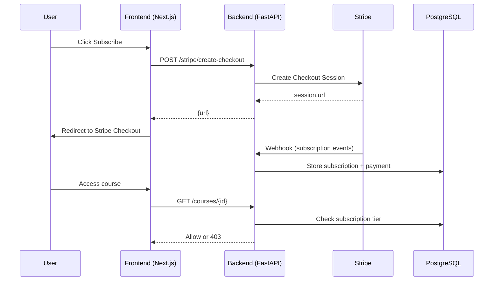

# Stripe-Only Payment & Feature Gating Implementation Plan

This document outlines a simplified implementation of **feature gating** and **Stripe-only payment integration** for the EdTech SaaS platform.

---

## ✅ Overview

We are removing:

* ❌ KHQR / Bakong integration
* ❌ Dual payment logic
* ❌ QR code + polling flow

We are keeping:

* ✅ Stripe Checkout
* ✅ Stripe Billing Portal
* ✅ Webhook-driven subscription management
* ✅ Server-side feature gating

---

## 🧱 Architecture

### Stripe Payment Flow



---

## 🧩 Backend Components

### 1. Feature Gate (Middleware)

**File:** `app/core/feature_gate.py`

* Enforces plan-based access (`free`, `pro`, `premium`)
* Used as FastAPI dependency:

```python
Depends(require_plan("pro"))
```

---

### 2. Stripe Endpoints

**File:** `app/api/v1/endpoints/stripe.py`

#### POST `/stripe/create-checkout`

* Creates Stripe Checkout Session
* Input: `plan_id`
* Output: `{ url }`

#### POST `/stripe/create-portal`

* Creates Billing Portal session
* Allows users to:

  * Cancel subscription
  * Update payment method

---

### 3. Webhook Handling (CRITICAL)

**File:** `app/api/webhooks/stripe/route.ts` or backend equivalent

Must handle:

* `customer.subscription.created`
* `customer.subscription.updated`
* `customer.subscription.deleted`
* `invoice.paid`

Responsibilities:

* Create/update `subscriptions` table
* Store Stripe IDs
* Sync subscription status

---

### 4. Config

**File:** `.env`

```env
STRIPE_SECRET_KEY=sk_live_...
STRIPE_WEBHOOK_SECRET=whsec_...
```

---

## 🗄️ Database

### Plans Table

Add:

```sql
stripe_price_id TEXT
```

Used to map:

* Local plan → Stripe price

---

## 🎨 Frontend Components

### 1. Subscription Page

**File:** `subscription/page.tsx`

Features:

* Current plan display
* Pricing cards
* Upgrade / downgrade buttons

---

### 2. Checkout Flow

**File:** `checkout/page.tsx`

* Calls backend `/stripe/create-checkout`
* Redirects to Stripe

---

### 3. Remove Payment Method Selection

Delete:

* KHQR buttons
* Payment tabs
* QR components

Replace with:

```tsx
<Button onClick={handleCheckout}>
  💳 Pay with Card
</Button>
```

---

## 🔐 Feature Gating

### Backend Enforcement

* Applied in:

  * `/courses/{id}`
  * `/lessons/*`

Logic:

* Compare `required_tier` vs user subscription
* Return `403` if not allowed

---

### Frontend UX

* Show locked courses
* Display upgrade CTA
* Prevent navigation if unauthorized

---

## 🧪 Verification Plan

### 1. Backend

```bash
alembic upgrade head
uvicorn app.main:app --reload
```

---

### 2. Frontend

```bash
npm run dev
```

---

### 3. Test Flow

* Visit `/dashboard/subscription`
* Click "Pay with Card"
* Complete Stripe test payment
* Verify:

  * Subscription created in DB
  * Access unlocked

---

### 4. Webhook Testing

```bash
stripe listen --forward-to localhost:3000/api/webhooks/stripe
```

Check:

* DB updates correctly
* Status = active

---

## ⚠️ Critical Notes

### Webhook is the source of truth

Do NOT rely on frontend success redirect.

Always:

* Trust Stripe webhook
* Update DB from webhook only

---

## 🚀 Benefits of This Approach

### Simpler System

* No QR logic
* No polling
* No async confirmation issues

### More Reliable

* Stripe handles:

  * retries
  * failures
  * fraud

### Faster Development

* Less code
* Easier debugging

---

## 📌 Future Consideration

You can add KHQR later if:

* Targeting Cambodian users heavily
* Need local payment convenience

For now:
👉 Stripe-only is the fastest path to launch

---
